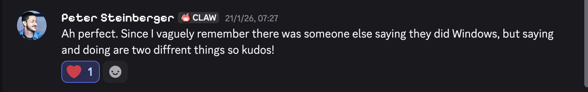

# Hey, I'm Ness 👋

Agentic Engineer

Automating the boring stuff so I can focus on the fun stuff.

---

## 🚀 Current Projects

📋 **[linear-cli](https://github.com/Finesssee/linear-cli)** - Powerful CLI for Linear.app project management

🚦 **[tdops](https://github.com/Finesssee/tdops)** - Tailscale + DigitalOcean droplet ops CLI

🎵 **[osu-sync](https://github.com/Finesssee/osu-sync)** - Rust TUI for syncing beatmaps between osu! versions

---

## 🍴 Forks

🔌 **[ProxyPilot](https://github.com/Finesssee/ProxyPilot)** - Windows-native proxy for AI coding tools *(forked from [CLIProxyAPI](https://github.com/router-for-me/CLIProxyAPI))*

📊 **[Win-CodexBar](https://github.com/Finesssee/Win-CodexBar)** - OpenAI/Claude usage stats for Windows *(forked from [CodexBar](https://github.com/steipete/CodexBar))*

🎮 **[Terra](https://github.com/Finesssee/Terra)** - Cursor for Terraria *(forked from [Steve](https://github.com/YuvDwi/Steve), adapted for Terraria)*

---

## 📦 Archive

🔥 **[Hublicate](https://github.com/Finesssee/Hublicate)** - Clone and recreate any website as a modern React app

---

## 🎯 Philosophy

> Wer nicht wagt, der nicht gewinnt
>
> *"Who doesn't dare, doesn't win"* (I'm not German but I like the quote)

Building tools that solve my own problems, then sharing them with the world.

---

## 💬 Kind Words

---

## 📈 Activity

---

## 📫 Connect

